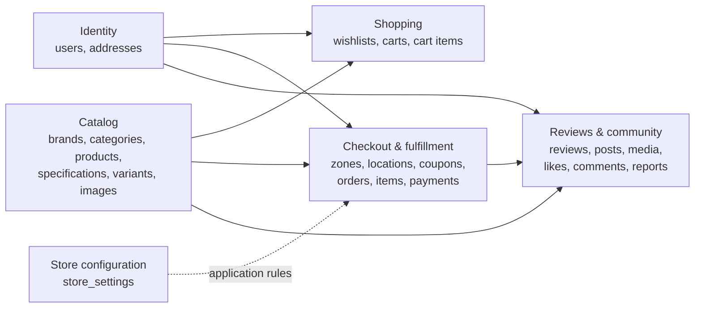

# TICKS Database Blueprint

Source of truth reviewed: all files in `database/migrations` and `app/Models` as of 2026-08-12. The definitions below describe the **final schema after every migration has run**, including later column/default changes.

## Scope and conventions

- `PK` = primary key, `FK` = foreign key, `UK` = unique key.
- Unless marked nullable, a column is required.
- Every `id()` / `foreignId()` is an unsigned big integer.
- Every `timestamps()` adds nullable `created_at` and `updated_at` timestamps.
- Every `softDeletes()` adds nullable `deleted_at`.
- Relationship cardinality is based on database nullability and uniqueness, not only Eloquent methods.
- The application has **26 domain tables** and **7 Laravel infrastructure tables** (33 tables total).

## Complete application ERD (Mermaid)

```mermaid
erDiagram
    USERS {
        bigint id PK
        varchar email UK
        timestamp email_verified_at "nullable"
        varchar password "nullable"
        varchar remember_token "nullable, 100"
        enum role "admin|user; default user"
        enum status "pending|active|banned; default pending"
        varchar name
        varchar phone "nullable, 20"
        varchar avatar "nullable"
        timestamp created_at "nullable"
        timestamp updated_at "nullable"
    }
    BRANDS {
        bigint id PK
        varchar name UK
        varchar slug UK
        enum tier "luxury|premium|everyday|smart_sport"
        varchar logo "nullable"
        text description "nullable"
        boolean is_active "default true"
        timestamp created_at "nullable"
        timestamp updated_at "nullable"
    }
    CATEGORIES {
        bigint id PK
        bigint parent_id FK "nullable"
        varchar name
        varchar slug UK
        text description "nullable"
        boolean is_active "default true"
        timestamp created_at "nullable"
        timestamp updated_at "nullable"
    }
    PRODUCTS {
        bigint id PK
        bigint brand_id FK
        bigint category_id FK
        varchar name
        varchar slug UK
        text description
        enum gender "men|women|unisex"
        varchar watch_type "default traditional; indexed"
        enum movement "automatic|quartz|mechanical|chronograph|smart"
        boolean is_active "default false"
        boolean is_featured "default false"
        timestamp created_at "nullable"
        timestamp updated_at "nullable"
    }
    PRODUCT_SPECIFICATIONS {
        bigint id PK
        bigint product_id FK,UK
        varchar case_size "nullable"
        varchar case_material "nullable"
        varchar case_thickness "nullable"
        varchar water_resistance "nullable"
        varchar glass_type "nullable"
        varchar weight "nullable"
        varchar dial_color "nullable"
        varchar movement_caliber "nullable"
        varchar power_reserve "nullable"
        varchar frequency "nullable"
        varchar jewels "nullable"
        varchar functions "nullable"
        varchar strap_material "nullable"
        varchar clasp_type "nullable"
        varchar battery_life "nullable"
        varchar display_type "nullable"
        varchar connectivity "nullable"
        varchar compatibility "nullable"
        varchar country_of_origin "nullable"
        json custom_specifications "nullable"
        timestamp created_at "nullable"
        timestamp updated_at "nullable"
    }
    PRODUCT_VARIANTS {
        bigint id PK
        bigint product_id FK
        varchar name
        varchar sku UK
        decimal price "10,2"
        decimal compare_price "nullable; 10,2"
        uint stock_quantity "default 0"
        boolean is_active "default true"
        boolean is_default "default false"
        timestamp created_at "nullable"
        timestamp updated_at "nullable"
    }
    PRODUCT_VARIANT_SPECIFICATIONS {
        bigint id PK
        bigint product_variant_id FK,UK
        json overrides "nullable"
        timestamp created_at "nullable"
        timestamp updated_at "nullable"
    }
    PRODUCT_IMAGES {
        bigint id PK
        bigint variant_id FK
        varchar image_url
        varchar alt_text "nullable"
        boolean is_primary "default false"
        uint sort_order "default 0"
        timestamp created_at "nullable"
        timestamp updated_at "nullable"
    }
    WISHLIST_ITEMS {
        bigint id PK
        bigint user_id FK "nullable; composite UK with product_id"
        varchar session_id "nullable; composite UK with product_id"
        bigint product_id FK "two composite unique keys"
        timestamp created_at "nullable"
        timestamp updated_at "nullable"
    }
    CARTS {
        bigint id PK
        bigint user_id FK "nullable"
        varchar session_id "nullable"
        timestamp expired_at "nullable"
        timestamp created_at "nullable"
        timestamp updated_at "nullable"
    }
    CART_ITEMS {
        bigint id PK
        bigint cart_id FK "composite UK with variant_id"
        bigint variant_id FK "composite UK with cart_id"
        uint quantity "default 1"
        decimal unit_price "10,2"
        timestamp created_at "nullable"
        timestamp updated_at "nullable"
    }
    SHIPPING_ZONES {
        bigint id PK
        varchar name UK
        decimal fee "10,2"
        varchar estimated_days "nullable"
        text description "nullable"
        boolean is_active "default true"
        timestamp created_at "nullable"
        timestamp updated_at "nullable"
    }
    SHIPPING_LOCATIONS {
        bigint id PK
        bigint shipping_zone_id FK
        varchar country
        varchar state_region "nullable"
        varchar city
        varchar district_area "nullable"
        boolean is_active "default true"
        timestamp created_at "nullable"
        timestamp updated_at "nullable"
    }
    COUPONS {
        bigint id PK
        varchar code UK "50"
        text description "nullable"
        enum discount_type "fixed|percentage"
        decimal discount_value "10,2"
        decimal minimum_order_amount "nullable; 10,2"
        date start_date
        date end_date
        uint usage_limit "nullable"
        uint used_count "default 0"
        boolean is_active "default true"
        timestamp created_at "nullable"
        timestamp updated_at "nullable"
    }
    ADDRESSES {
        bigint id PK
        bigint user_id FK
        varchar label "nullable"
        varchar full_name
        varchar phone "20"
        varchar country
        varchar state_region "nullable"
        varchar city
        varchar district_area "nullable"
        varchar postal_code "nullable, 20"
        varchar address_line1
        varchar address_line2 "nullable"
        boolean is_default "default false"
        timestamp created_at "nullable"
        timestamp updated_at "nullable"
    }
    ORDERS {
        bigint id PK
        bigint user_id FK "nullable"
        bigint coupon_id FK "nullable"
        bigint shipping_location_id FK
        varchar order_number UK "50"
        varchar email
        varchar shipping_full_name
        varchar shipping_phone "20"
        varchar shipping_country
        varchar shipping_state_region "nullable"
        varchar shipping_city
        varchar shipping_district_area "nullable"
        varchar shipping_postal_code "nullable, 20"
        varchar shipping_address_line1
        varchar shipping_address_line2 "nullable"
        varchar billing_full_name
        varchar billing_phone "20"
        varchar billing_country
        varchar billing_state_region "nullable"
        varchar billing_city
        varchar billing_district_area "nullable"
        varchar billing_postal_code "nullable, 20"
        varchar billing_address_line1
        varchar billing_address_line2 "nullable"
        bigint shipping_address_id FK "nullable"
        bigint billing_address_id FK "nullable"
        decimal subtotal "10,2"
        decimal discount "10,2; default 0"
        decimal tax "10,2; default 0"
        decimal shipping_fee "10,2; default 0"
        decimal insurance_fee "10,2; default 0"
        decimal total "10,2"
        enum status "pending|processing|shipped|delivered|cancelled"
        varchar stripe_payment_intent_id UK "nullable"
        text notes "nullable"
        timestamp created_at "nullable"
        timestamp updated_at "nullable"
    }
    ORDER_ITEMS {
        bigint id PK
        bigint order_id FK
        bigint variant_id FK
        varchar variant_sku "100; snapshot"
        varchar product_name "snapshot"
        varchar variant_name "100; snapshot"
        decimal unit_price "10,2; snapshot"
        uint quantity
        decimal subtotal "10,2"
        timestamp created_at "nullable"
        timestamp updated_at "nullable"
    }
    PAYMENTS {
        bigint id PK
        bigint order_id FK
        enum method "kbzpay|wavepay|bank_transfer|card"
        enum status "pending|paid|failed|refunded"
        varchar transaction_id "nullable"
        decimal amount "10,2"
        timestamp paid_at "nullable"
        timestamp created_at "nullable"
        timestamp updated_at "nullable"
    }
    STORE_SETTINGS {
        bigint id PK
        varchar store_name "default TICKS"
        varchar legal_name "nullable"
        varchar support_email "nullable"
        varchar support_phone "nullable, 40"
        text business_address "nullable"
        varchar default_country "100; default Myanmar"
        varchar order_prefix "8; default TCK"
        ushort low_stock_threshold "default 5"
        boolean insurance_enabled "default true"
        decimal insurance_rate "6,4; default 0.0200"
        boolean guest_checkout_enabled "default true"
        timestamp created_at "nullable"
        timestamp updated_at "nullable"
    }
    REVIEWS {
        bigint id PK
        bigint user_id FK "composite UK with product_id"
        bigint product_id FK "composite UK with user_id"
        bigint order_item_id FK "nullable"
        utinyint rating
        text comment "nullable"
        varchar status "20; default pending"
        boolean verified_purchase "default true"
        timestamp created_at "nullable"
        timestamp updated_at "nullable"
        timestamp deleted_at "nullable"
    }
    REVIEW_IMAGES {
        bigint id PK
        bigint review_id FK
        varchar image_path
        ushort sort_order "default 0"
        varchar status "20; default pending"
        timestamp created_at "nullable"
        timestamp updated_at "nullable"
    }
    COMMUNITY_POSTS {
        bigint id PK
        bigint user_id FK
        bigint product_id FK
        bigint order_item_id FK
        text caption "nullable"
        varchar location "nullable, 150"
        varchar status "20; default pending"
        varchar visibility "20; default public"
        boolean is_featured "default false"
        uint likes_count "default 0"
        uint comments_count "default 0"
        timestamp published_at "nullable"
        timestamp created_at "nullable"
        timestamp updated_at "nullable"
        timestamp deleted_at "nullable"
    }
    COMMUNITY_POST_MEDIA {
        bigint id PK
        bigint post_id FK
        varchar media_type "20; default image"
        varchar file_path "500"
        varchar thumbnail_path "nullable, 500"
        uint width "nullable"
        uint height "nullable"
        varchar alt_text "nullable"
        ushort sort_order "default 0"
        varchar status "20; default pending"
        timestamp created_at "nullable"
        timestamp updated_at "nullable"
    }
    COMMUNITY_POST_LIKES {
        bigint id PK
        bigint post_id FK "composite UK with user_id"
        bigint user_id FK "composite UK with post_id"
        timestamp created_at "nullable"
        timestamp updated_at "nullable"
    }
    COMMUNITY_COMMENTS {
        bigint id PK
        bigint post_id FK
        bigint user_id FK
        bigint parent_id FK "nullable"
        text body
        varchar status "20; default published"
        timestamp created_at "nullable"
        timestamp updated_at "nullable"
        timestamp deleted_at "nullable"
    }
    COMMUNITY_REPORTS {
        bigint id PK
        bigint reporter_id FK "polymorphic composite UK"
        varchar reportable_type "50; polymorphic composite UK"
        bigint reportable_id "polymorphic composite UK"
        varchar reason "50"
        text details "nullable"
        varchar status "20; default open"
        bigint reviewed_by FK "nullable"
        timestamp reviewed_at "nullable"
        text resolution_notes "nullable"
        timestamp created_at "nullable"
        timestamp updated_at "nullable"
    }

    CATEGORIES o|--o{ CATEGORIES : "parent has children"
    BRANDS ||--o{ PRODUCTS : has
    CATEGORIES ||--o{ PRODUCTS : classifies
    PRODUCTS ||--o| PRODUCT_SPECIFICATIONS : has
    PRODUCTS ||--o{ PRODUCT_VARIANTS : has
    PRODUCT_VARIANTS ||--o| PRODUCT_VARIANT_SPECIFICATIONS : overrides
    PRODUCT_VARIANTS ||--o{ PRODUCT_IMAGES : has
    USERS o|--o{ WISHLIST_ITEMS : owns
    PRODUCTS ||--o{ WISHLIST_ITEMS : appears_in
    USERS o|--o{ CARTS : owns
    CARTS ||--o{ CART_ITEMS : contains
    PRODUCT_VARIANTS ||--o{ CART_ITEMS : selected_as
    SHIPPING_ZONES ||--o{ SHIPPING_LOCATIONS : contains
    USERS ||--o{ ADDRESSES : owns
    USERS o|--o{ ORDERS : places
    COUPONS o|--o{ ORDERS : discounts
    SHIPPING_LOCATIONS ||--o{ ORDERS : fulfills
    ADDRESSES o|--o{ ORDERS : "shipping snapshot source"
    ADDRESSES o|--o{ ORDERS : "billing snapshot source"
    ORDERS ||--o{ ORDER_ITEMS : contains
    PRODUCT_VARIANTS ||--o{ ORDER_ITEMS : references
    ORDERS ||--o{ PAYMENTS : receives
    USERS ||--o{ REVIEWS : writes
    PRODUCTS ||--o{ REVIEWS : receives
    ORDER_ITEMS o|--o{ REVIEWS : verifies
    REVIEWS ||--o{ REVIEW_IMAGES : has
    USERS ||--o{ COMMUNITY_POSTS : creates
    PRODUCTS ||--o{ COMMUNITY_POSTS : features
    ORDER_ITEMS ||--o{ COMMUNITY_POSTS : verifies
    COMMUNITY_POSTS ||--o{ COMMUNITY_POST_MEDIA : has
    COMMUNITY_POSTS ||--o{ COMMUNITY_POST_LIKES : receives
    USERS ||--o{ COMMUNITY_POST_LIKES : gives
    COMMUNITY_POSTS ||--o{ COMMUNITY_COMMENTS : receives
    USERS ||--o{ COMMUNITY_COMMENTS : writes
    COMMUNITY_COMMENTS o|--o{ COMMUNITY_COMMENTS : replies
    USERS ||--o{ COMMUNITY_REPORTS : reports
    USERS o|--o{ COMMUNITY_REPORTS : reviews
```

`COMMUNITY_REPORTS(reportable_type, reportable_id)` is a logical polymorphic relationship, so no physical FK can point to one target table. Likely targets are community posts/comments, but the migration does not enforce or enumerate them.

## Foreign keys and delete behavior

| Child column | Parent | On delete |
|---|---|---|
| `categories.parent_id` | `categories.id` | SET NULL |
| `products.brand_id` | `brands.id` | RESTRICT |
| `products.category_id` | `categories.id` | RESTRICT |
| `product_specifications.product_id` | `products.id` | CASCADE |
| `product_variants.product_id` | `products.id` | CASCADE |
| `product_variant_specifications.product_variant_id` | `product_variants.id` | CASCADE |
| `product_images.variant_id` | `product_variants.id` | CASCADE |
| `wishlist_items.user_id` | `users.id` | CASCADE |
| `wishlist_items.product_id` | `products.id` | CASCADE |
| `carts.user_id` | `users.id` | CASCADE |
| `cart_items.cart_id` | `carts.id` | CASCADE |
| `cart_items.variant_id` | `product_variants.id` | CASCADE |
| `shipping_locations.shipping_zone_id` | `shipping_zones.id` | CASCADE |
| `addresses.user_id` | `users.id` | CASCADE |
| `orders.user_id` | `users.id` | SET NULL |
| `orders.coupon_id` | `coupons.id` | SET NULL |
| `orders.shipping_location_id` | `shipping_locations.id` | RESTRICT |
| `orders.shipping_address_id` | `addresses.id` | SET NULL |
| `orders.billing_address_id` | `addresses.id` | SET NULL |
| `order_items.order_id` | `orders.id` | CASCADE |
| `order_items.variant_id` | `product_variants.id` | RESTRICT |
| `payments.order_id` | `orders.id` | CASCADE |
| `reviews.user_id` | `users.id` | CASCADE |
| `reviews.product_id` | `products.id` | CASCADE |
| `reviews.order_item_id` | `order_items.id` | SET NULL |
| `review_images.review_id` | `reviews.id` | CASCADE |
| `community_posts.user_id` | `users.id` | CASCADE |
| `community_posts.product_id` | `products.id` | CASCADE |
| `community_posts.order_item_id` | `order_items.id` | RESTRICT |
| `community_post_media.post_id` | `community_posts.id` | CASCADE |
| `community_post_likes.post_id` | `community_posts.id` | CASCADE |
| `community_post_likes.user_id` | `users.id` | CASCADE |
| `community_comments.post_id` | `community_posts.id` | CASCADE |
| `community_comments.user_id` | `users.id` | CASCADE |
| `community_comments.parent_id` | `community_comments.id` | CASCADE |
| `community_reports.reporter_id` | `users.id` | CASCADE |
| `community_reports.reviewed_by` | `users.id` | SET NULL |

## Unique and secondary indexes

- Single-column unique: `users.email`, `brands.name`, `brands.slug`, `categories.slug`, `products.slug`, `product_specifications.product_id`, `product_variants.sku`, `product_variant_specifications.product_variant_id`, `shipping_zones.name`, `coupons.code`, `orders.order_number`, `orders.stripe_payment_intent_id`.
- Composite unique: `wishlist_items(user_id, product_id)`, `wishlist_items(session_id, product_id)`, `cart_items(cart_id, variant_id)`, `reviews(user_id, product_id)`, `community_post_likes(user_id, post_id)`, `community_reports(reporter_id, reportable_type, reportable_id)`.
- Explicit non-unique indexes: `products(watch_type)`; `reviews(product_id, status, created_at)`; `review_images(review_id, sort_order)`; `community_posts(status, published_at)`, `(product_id, status, published_at)`, `(user_id, created_at)`; `community_post_media(post_id, sort_order)`; `community_post_likes(post_id, created_at)`; `community_comments(post_id, status, created_at)`; `community_reports(reportable_type, reportable_id)`.
- Foreign-key columns are normally indexed by MySQL/InnoDB as required for FK enforcement, even where the migration does not call `index()` explicitly.

## Laravel infrastructure tables

These are operational tables, not business entities, so they are intentionally outside the main ERD.

| Table | Columns and constraints |
|---|---|
| `password_reset_tokens` | `email varchar PK`, `token varchar`, `created_at timestamp nullable` |
| `sessions` | `id varchar PK`, `user_id bigint nullable INDEX` (not an FK), `ip_address varchar(45) nullable`, `user_agent text nullable`, `payload longtext`, `last_activity int INDEX` |
| `cache` | `key varchar PK`, `value mediumtext`, `expiration int INDEX` |
| `cache_locks` | `key varchar PK`, `owner varchar`, `expiration int INDEX` |
| `jobs` | `id bigint PK`, `queue varchar INDEX`, `payload longtext`, `attempts unsigned tinyint`, `reserved_at unsigned int nullable`, `available_at unsigned int`, `created_at unsigned int` |
| `job_batches` | `id varchar PK`, `name varchar`, `total_jobs int`, `pending_jobs int`, `failed_jobs int`, `failed_job_ids longtext`, `options mediumtext nullable`, `cancelled_at int nullable`, `created_at int`, `finished_at int nullable` |
| `failed_jobs` | `id bigint PK`, `uuid varchar UK`, `connection text`, `queue text`, `payload longtext`, `exception longtext`, `failed_at timestamp default current` |

Note: `sessions.user_id` looks relational but the migration creates only an index, not a foreign-key constraint.

## Model-to-schema audit

The migrations are the authoritative physical design. The following model-layer gaps are worth knowing when drawing or implementing the ERD:

1. `Category` declares `products()` but does not declare the self-referencing `parent()` / `children()` relationships that the database supports.
2. `User` omits inverse relationships for carts, wishlist items, community likes/comments/reports, and reviewed reports. The database relationships still exist.
3. `ProductVariant` omits inverse `cartItems()` and `orderItems()` relationships; `OrderItem` also lacks inverse review/community-post collections.
4. `Address` lacks inverse shipping/billing order relationships.
5. `CommunityReport` defines `reporter()` only. It lacks `reviewer()` for `reviewed_by` and lacks a `morphTo()` relationship for `reportable_type/reportable_id`.
6. `CommunityPostMedia` correctly overrides its table name because Laravel would otherwise pluralize it as `community_post_media`; the actual migration table is singular `community_post_media`.
7. `reviews.status`, image/media status, community status/visibility, and polymorphic report fields are strings rather than database enums. Their valid values are application conventions, not DB-enforced domains.
8. `rating` is an unsigned tiny integer but has no DB check constraint limiting it to 1–5.
9. The schema does not enforce exactly one default address, one default variant, or one primary image. Application code must maintain those invariants.
10. `store_settings` is treated as a singleton by application convention (`first()`), but the database permits multiple rows.
11. Both wishlist identity fields are nullable. MySQL unique indexes permit multiple `NULL` values, so the two composite unique keys do not by themselves enforce “exactly one of user/session” or prevent every malformed/duplicate guest case.
12. Orders and order items intentionally keep snapshot columns. Therefore historical shipping/billing, product names, SKU, and price survive later edits to source records.

## High-level domain map

